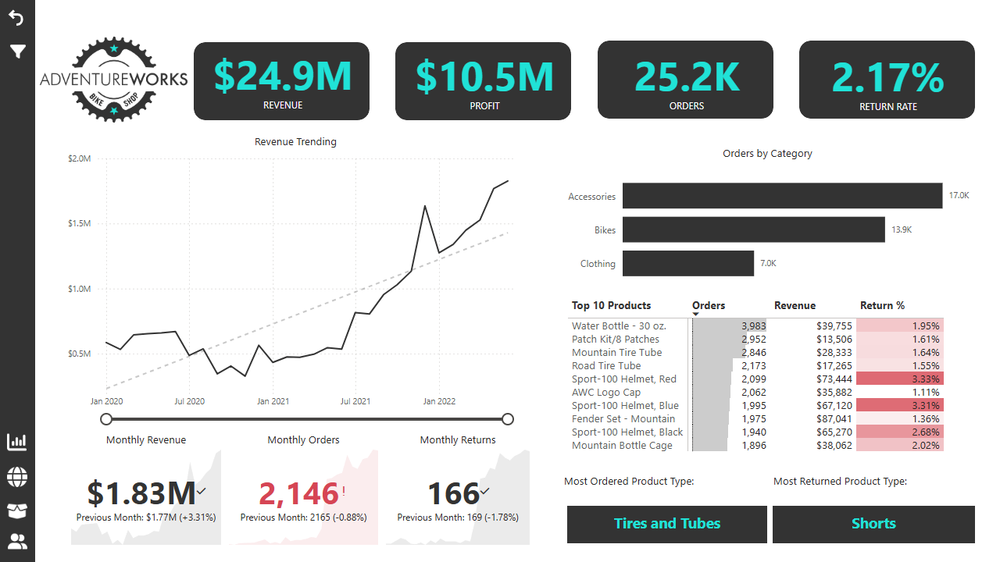
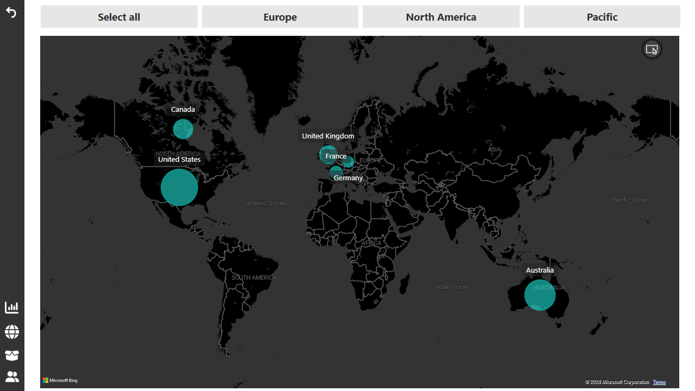
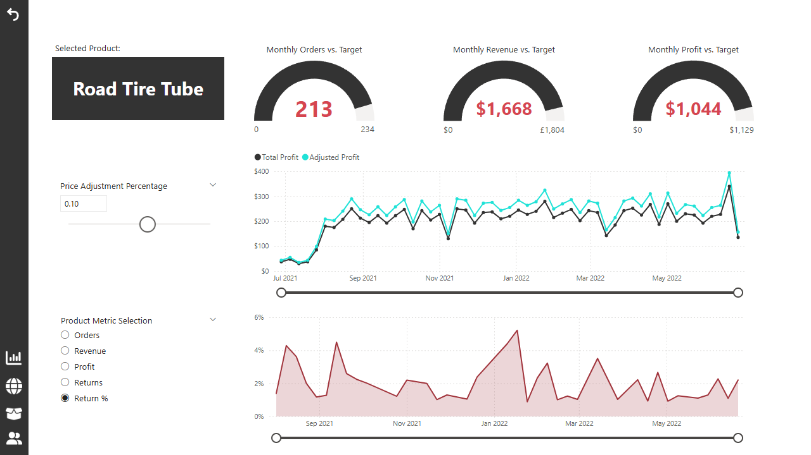
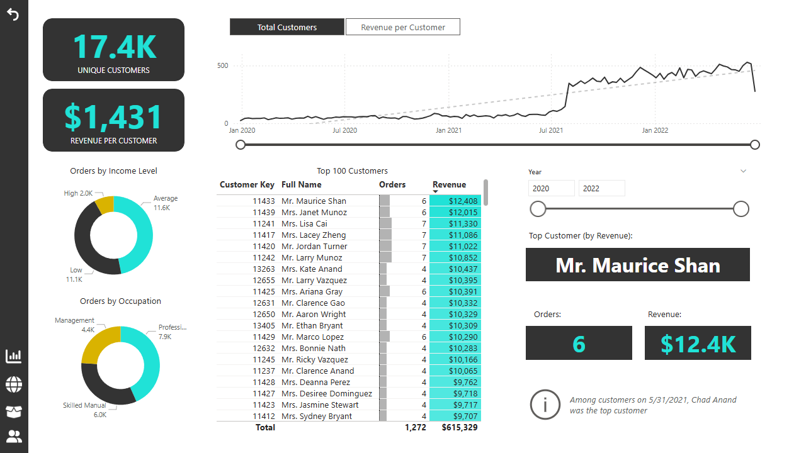

# AdventureWorks Sales Dashboard

> Business Intelligence dashboard built in Microsoft Power BI for analyzing sales, customer, product, and regional performance using the AdventureWorks dataset.

---

## Problem

Organizations generate large volumes of transactional sales data, but raw records alone provide little value without meaningful analysis.

This project transforms the AdventureWorks sales dataset into an interactive Business Intelligence dashboard, enabling stakeholders to monitor business performance, identify sales trends, evaluate product performance, and understand customer behavior through visual analytics.

---

## Dataset

The project uses Microsoft's **AdventureWorks** sample dataset, representing a fictional multinational bicycle manufacturing company.

The analytical model integrates multiple related tables, including:

| Table | Purpose |
|---|---|
| Sales | Sales transactions and revenue |
| Returns | Product returns |
| Customers | Customer information |
| Products | Product catalog |
| Product Categories | Product grouping |
| Product Subcategories | Detailed product classification |
| Calendar | Time intelligence |
| Territories | Sales territories |
| Geography | Regional analysis |

---

## Approach

The dashboard follows a complete Business Intelligence workflow using Microsoft Power BI.

| Stage | Description |
|---|---|
| Power Query | Data cleaning and transformation |
| Data Modeling | Star schema with optimized relationships |
| DAX | Business measures and KPI calculations |
| Visualization | Interactive dashboards and analytical reports |

The report enables users to explore business performance through interactive filtering, drill-down capabilities, and cross-visual interactions.

---

## Dashboard

### Executive Dashboard

Provides a high-level overview of business performance through key performance indicators and sales trends.

Features include:

- Revenue KPIs
- Profit KPIs
- Order Metrics
- Return Rate
- Monthly Revenue Trend
- Sales Performance Overview

---

### Geographic Analysis

Visualizes regional sales performance using map-based reporting.

Features include:

- Sales by Country
- Sales by Region
- Geographic Distribution
- Regional Performance Comparison

---

### Product Detail

Provides detailed analysis of product performance.

Features include:

- Revenue by Product
- Orders by Product
- Return Analysis
- Category Performance
- Product Rankings

---

### Customer Detail

Explores customer purchasing behavior and revenue contribution.

Features include:

- Customer Revenue
- Customer Orders
- Purchase Trends
- High-Value Customers

---

## Skills Demonstrated

| Area | Skills |
|---|---|
| Data Preparation | Power Query, ETL, Data Cleaning |
| Data Modeling | Star Schema, Relationships, Dimensional Modeling |
| DAX | Measures, Time Intelligence, KPI Development |
| Visualization | Interactive Dashboards, KPI Cards, Maps, Charts, Tables |
| Business Intelligence | Sales Analysis, Customer Analysis, Product Analysis, Geographic Analysis |

---

## Dashboard Features

- Interactive slicers
- Cross-filtering and cross-highlighting
- Drill-down hierarchies
- KPI cards
- Line charts
- Column charts
- Bar charts
- Donut charts
- Treemaps
- Matrix tables
- Maps
- Dynamic filtering
- Time intelligence analysis

---

## Business Insights

The dashboard enables users to:

- Monitor revenue and profit performance
- Track sales trends over time
- Compare regional performance
- Identify top-performing products
- Analyze customer purchasing behavior
- Evaluate return rates
- Explore category and subcategory performance

---

## Tech Stack

| Technology | Purpose |
|---|---|
| Microsoft Power BI | Dashboard development |
| Power Query | Data transformation |
| DAX | Business calculations |
| AdventureWorks Dataset | Business data |

---

## Future Improvements

Potential future enhancements include:

- Drill-through pages
- Bookmark navigation
- Report tooltips
- Row-Level Security (RLS)
- Power BI Service deployment
- Performance optimization
- Additional business dashboards

---

## Author

**Nafis Yousefi Rad**

Power BI Portfolio Project
